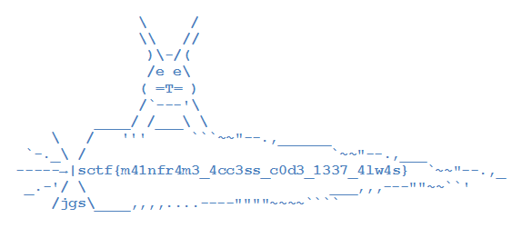
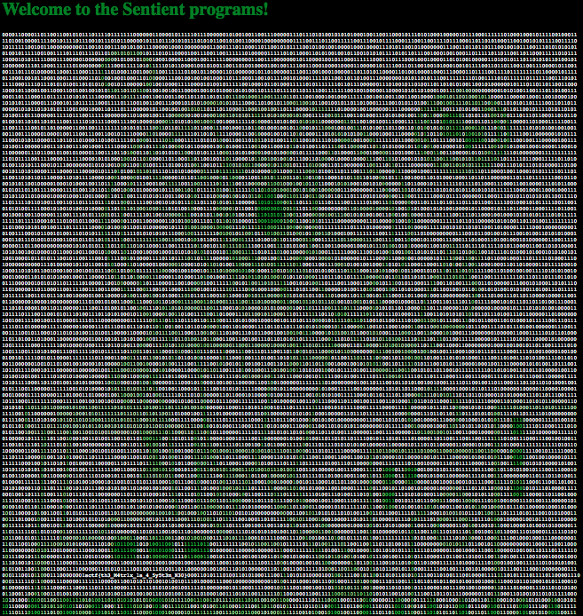
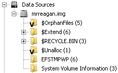
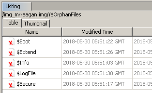

# 2018-05-31-SecurityFest #

[CTFTime link](https://ctftime.org/event/622) | [Website](https://securityfest.ctf.rocks/dashboard)

---

## Challenges ##

### Misc ###

 - [x] [51 Sanity check](#51-misc--sanity-check)
 - [ ] 495 The last flight of the osiris
 - [ ] 468 Tracing mr. anderson
 - [x] [51 Zion](#51-misc--zion)
 - [x] [407 All the keys](#407-misc--all-the-keys)
 - [x] [51 Everywhere](#51-misc--everywhere)
 - [x] [51 Mr.reagan](#51-misc-mrreagan)

### Rev ###

 - [x] 51 Bluepill

### Pwn ###

 - [ ] 364 Cypher
 - [ ] 54 Sshnuke
 - [ ] 499 Goldrain
 - [ ] 485 Greenrain
 - [ ] 261 Bowrain

### Crypto ###

 - [ ] 500 Agent communications
 - [x] 485 The note
 - [ ] 499 Intercepting sentinels
 - [x] 51 The oracle

### Web ###

 - [ ] 51 Screensavers
 - [ ] 314 Pongdom
 - [x] 51 Excesss
 - [ ] 499 Excesss ii

---

## 51 Misc / Sanity check ##

**Description**

> Flag is in the topic of #securityfest-ctf @ irc.freenode.net

**No files provided**

**Solution**

Login to Freenode, `/join #securityfest-ctf`, `/topic`:

`sctf{securityfestctf_2018}`

## 51 Misc / Zion ##

**Description**

> Is this the access codes to the Zion mainframe?. We have only bits and pieces of information.

**Files provided**

 - `zion.tar.gz` - archive:
   - `YouKnow`

**Solution**

After extracting the `YouKnow` file, we can see that there are many references to Word, e.g. `word/document.xml`. If we make Word open the file, it complains a bit, but it opens it just fine as an Office Open XML document. The contents show some flavour text and a red rabbit:

At first I thought this might be encoding a program in some [esoteric language](https://esolangs.org/wiki/Main_Page), but I didn't have much hope, since there was very little actual text data shown in the image.

Back to looking at the file in a hex editor, we can first notice that it starts with `PK`, just like a zip file. And indeed, we can unzip the file and it contains various XML files, as well as the red rabbit in a `media` folder. But there is one more weird thing – if we scroll all the way to the end, we see `KP`. And not far behind that, `sler./sler_`? In the extracted data, we did get a `_rels/.rels` folder. It is reversed, but why? Around the middle of the file we see where the reversal happens, but the mirror images are not exactly the same.

    0003820: 0000 382e 0000 776f 7264 2f74 6865 6d65  ..8...word/theme
    0003830: 2f74 6865 6d65 312e 786d 6c50 4b01 0214  /theme1.xmlPK...
    0003840: 0014 0008 0808 00bc 94b6 4c29 ef3d 8b4a  ..........L).=.J
    0003850: 0100 0016 0500 0013 0000 0000 0000 0000  ................
    0003860: 0000 0000 002f 3400 005b 436f 6e74 656e  ...../4..[Conten
    0003870: 745f 5479 7065 735d 2e78 6d6c 504b 0506  t_Types].xmlPK..
    0003880: 0000 0000 0b00 0b00 c202 0000 ba35 0000  .............5..
    0003890: 0000 0000 0000 340e 0000 0303 000c 000c  ......4.........
    00038a0: 0000 0000 0605 4b50 6c6d 782e 5d73 6570  ......KPlmx.]sep
    00038b0: 7954 5f74 6e65 746e 6f43 5b00 0032 7900  yT_tnetnoC[..2y.
    00038c0: 0000 0000 0000 0000 0000 0000 1300 0005  ................
    00038d0: 9300 0001 54a6 0075 bf4c b694 7c00 0808  ....T..u.L..|...
    00038e0: 0800 1400 1402 014b 506c 6d78 2e31 656d  .......KPlmx.1em
    00038f0: 6568 742f 656d 6568 742f 6472 6f77 0000  eht/emeht/drow..
    0003900: 2c82 0000 0000 0000 0000 0000 0000 0015  ,...............

Some of the numbers don't match. So let's finally reverse the file and unzip it again. And indeed, there is another image, but this time showing the flag!

`sctf{m41nfr4m3_4cc3ss_c0d3_1337_4lw4s}`

## 407 Misc / All the keys ##

**Description**

> Trinity needs help, find the key in time and discover the Matrix.

**Files provided**

 - `allthekeys.tar.gz`

**Solution**

After extracting the archive, we see that it includes a bunch of files with random 4-character filenames. Looking around with a hexeditor and grep, we can categorise the files into folders as follows:

 - `cert/` - 1 SSL certificate file
 - `binary/` - 66 binary files
 - `ec/` - 65 private EC keys
 - `empty/` - 28 empty files
 - `rsa/` - 4 private RSA keys

Since the number of private keys and binary files was (more or less) the same, my first attempt was to decrypt the binary files with the private keys we have. I tested at first with the RSA keys, e.g.:

    for binary in binary/*; do
      for key in rsa/*; do
        openssl rsautl -in "$binary" -inkey "$key" -decrypt
      done
    done

But all of these failed. My working theory was that there would be a 1-to-1 correspondence between the keys and the binary files, so seeing as none of the RSA keys worked on any of the binary files, I tried something else.

Looking more closely at the certificate file, it includes some human-readable data, as well as an encoded certificate representation within `-----BEGIN CERTIFICATE-----` and `-----END CERTIFICATE-----`. What happens if we make OpenSSL parse this encoded representation? Maybe the encoded data is actually different.

    $ openssl x509 -in cert/6c8e -text -noout

The output is pretty much the same, but our original file has some extra data:

    Response Single Extensions:
          CT Certificate SCTs:
          SCT validation status: valid
          Signed Certificate Timestamp:
               Version   : v1 (0x0)
               Log       : Morpheus Tesfytiruces CT log
               Log ID    : SE:CF:68:74:74:70:73:3a:2f:2f:6d:69:6b:65:79:2e:
                           63:74:66:2e:72:6f:63:6b:73:00:00:00:00:00:00:00
          Timestamp : Jun 1 08:05:26.276 1999 GMT
          Extensions: none
          Signature : ecdsa-with-SHA256
               13:37:13:37:13:37:13:37:13:37:13:37:13:37:13:37:
               13:37:13:37:13:37:13:37:13:37:13:37:13:37:13:37:
               13:37:13:37:13:37:13:37:13:37:13:37:13:37:13:37:
               13:37:13:37:13:37:13:37:13:37:13:37:13:37:13:37:
               13:37:13:37:13:37:13

Interesting. The signature is obviously fake, but looking closely at the log ID, it doesn't look like binary data. And indeed, if we convert `68:74:70:...:6F:63:6B` to ASCII, we get:

    https://mikey.ctf.rocks

If we actually try to access the website, it doesn't really work. The server is saying `400 No required SSL certificate was sent`. We need to send a certificate TO the server? Apparently there is a thing called client certificates, where the server requests that the client sends a certificate. Very useful information, and we can now guess that the certificate we have is not the server certificate, but a client certificate we need to provide. But naturally, there is only a public key in the certificate:

    Subject Public Key Info:
        Public Key Algorithm: id-ecPublicKey
            Public-Key: (256 bit)
            pub: 
                04:65:18:ab:8d:b3:c5:d4:65:f1:65:f0:85:08:1c:
                56:63:18:47:ad:38:b3:3e:b7:36:57:bd:e4:15:eb:
                f8:81:4d:c0:ed:43:32:9b:52:82:47:8c:97:e1:5f:
                96:a5:1b:e0:63:75:1b:6d:fb:42:40:a1:65:08:93:
                83:94:80:7b:eb
            ASN1 OID: prime256v1

To make this work we need the private key. Luckily we have dozens of them. Let's extract the public keys from all of our RSA keys:

    for key in rsa/*; do
      openssl rsa -in "$key" -text -noout
    done

Nope, how about the EC keys?

    for key in ec/*; do
      openssl ec -in "$key" -text -noout
    done

No luck! So what about the binary files? Now that we have a server to access, we will probably find the flag on the server, not in the files. If we look at all the binary files in a hexeditor, we can notice something – every single one of them starts with an ASCII `0`. [Sounds familiar](https://www.cryptosys.net/pki/rsakeyformats.html).

> Binary DER-encoded format. This is sometimes called ASN.1 BER-encoded (there is a subtle difference between BER- and DER-encodings: DER is just a stricter subset of BER). The most compact form. If you try to view the file with a text editor it is full of "funny" characters. The first character in the file is almost always a '0' character (0x30).

So let's extract the public keys from these as well:

    for key in binary/*; do
      openssl ec -in "$key" -inform DER -text -noout
    done

One of them in particular is useful:

    $ openssl ec -in binary/ddcb -inform DER -text -noout
    read EC key
    Private-Key: (256 bit)
    priv:
        13:75:f1:f0:66:84:74:e5:5e:f4:03:2b:e3:92:38:
        39:47:8d:10:e4:10:c4:2d:0d:a3:36:7b:21:e4:a7:
        25:53
    pub: 
        04:65:18:ab:8d:b3:c5:d4:65:f1:65:f0:85:08:1c:
        56:63:18:47:ad:38:b3:3e:b7:36:57:bd:e4:15:eb:
        f8:81:4d:c0:ed:43:32:9b:52:82:47:8c:97:e1:5f:
        96:a5:1b:e0:63:75:1b:6d:fb:42:40:a1:65:08:93:
        83:94:80:7b:eb
    ASN1 OID: prime256v1
    NIST CURVE: P-256

The `pub` section matches what we have in our client certificate. I tried for a bit to make `curl` work with the certificate + the private key (converted to PEM format), but no luck, the server kept responding with the same error. So:

    openssl s_client -key binary/ddcb -cert cert/6c8e -connect mikey.ctf.rocks:443

And indeed, we are flooded with HTML. After opening this, we see a nice ASCII art image, and the flag hiding among the text!

`sctf{th3_M4tr1x_1s_4_5y5t3m_N30}`

## 51 Misc / Everywhere ##

**Description**

> Too much information to decode.

**Files provided**

 - `everywhere.tar.gz` - containing `everywhere`, a JPEG file

**Solution**

The JPEG shows some typical matrix-y green text visuals. Looking at the EXIF chunks, metadata, and hexdump reveals nothing of interest. Apparently this is just a JPEG image and nothing more. Based on the hint I tried to extend the canvas of the JPEG image, but no, there is just enough data encoded to fill the canvas.

Since the challenge is called everywhere, let's look everywhere. The background video playing on the actual CTF submission server is also matrix-y. But it also seems very much like an excerpt from an actual movie (Animatrix maybe?), so modifying that to include the flag would be a lot of effort.

How about the Internet? Using a reverse image search, we can search for the picture we have. And there are many matches. [Some of them](https://manshoor.com/uploads/editor/source/Westworld4%40manshoor.com.jpg?1478435393695) match the dimensions of our file exactly – 960x678. The matches are found on regular websites, it would be impossible to sneak a flag in there and expect people to find it. So after downloading a matching image from the Internet, we can compare it to the one we've been given. Putting the two in Photoshop one on top of the other, we can use the "Difference" blending mode to only see where the images don't match. And indeed, there is a single line that was added, here made somewhat brigther (hopefully more readable):

`sctf{y0u_411_100k_th3_54m3_t0_m3}`

(I wonder if anybody solved this by just noticing the flag in the given image.)

## 51 Misc / Mr.reagan ##

**Description**

> Agent Smith got this from Mr. Reagan, a EMP was activated nearby, or?

**Files provided**

 - `mrreagan.tar.gz` - containing `mrreagan`, a disk image

**Solution**

After mounting the image, we see that it is an NTFS filesystem. We can see the `$RECYCLE.BIN` folder, the `System Volume Information` folder, but also an `EFSTMPWP`. If we search for `EFSTMPWP`, we [find](http://www.majorgeeks.com/content/page/what_is_the_efstmpwp_folder_and_can_you_delete_it.html) it is an artefact of using Cipher on Windows to erase data from empty space on a filesystem, thereby making it irrecoverable (unlike just unlinking a file). So this would be the EMP that the challenge description mentions. But the description also has a question mark!

We can open the image in [Autopsy](http://sleuthkit.org/autopsy/index.php), always useful for Windows forensics. And indeed, there are some orphan files:

All of these show some ASCII data that looks quite like Base64. One of them in particular produces `sctf{` after decoding, so clearly this is the right direction. But some of the others produce garbage? Let's extract the five files.

    $ cat export/*
    c2N0ZnszbD 
    NjdHIwbTRn 
    bjN0MWNfcH 
    VsNTNfdzRz 
    X2Y0azN9Cg 
    $ cat export/* | base64 -D
    sctf{3l3ctr0m4gn3t1c_pul53_w4s_f4k3}

And now it works. The problem was that the Base64 data first needed to be concatenated, then decoded, otherwise the decoded bits were offset.

`sctf{3l3ctr0m4gn3t1c_pul53_w4s_f4k3}`
